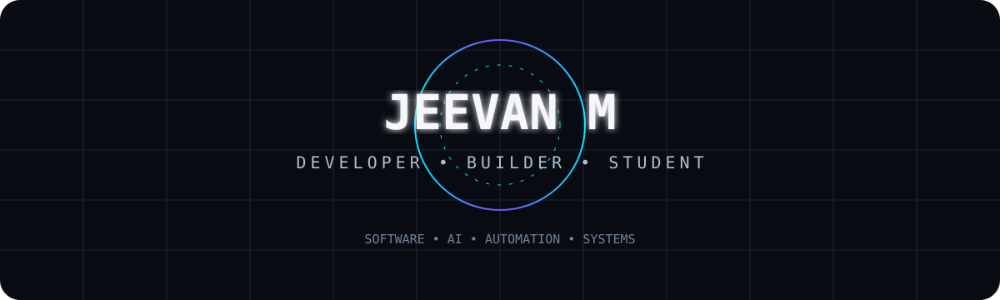
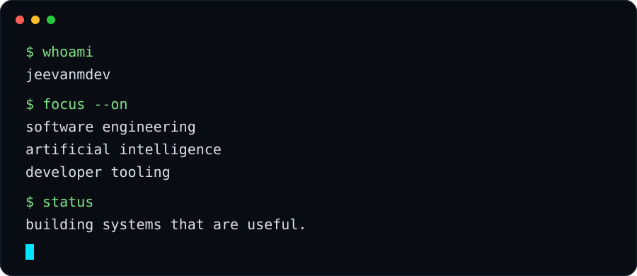
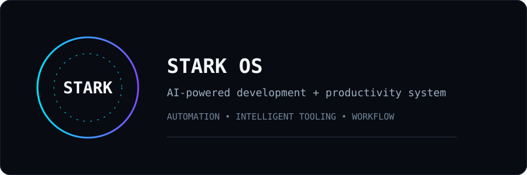
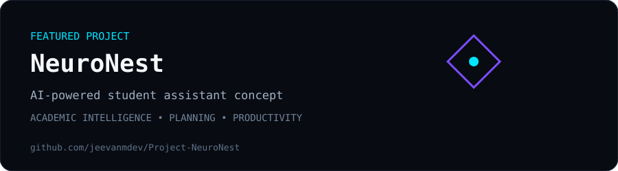

<a href="https://jeevan.gt.tc">Website</a> · <a href="https://github.com/jeevanmdev">GitHub</a> · <a href="https://github.com/jeevanmdev/Project-NeuroNest">NeuroNest</a>

---

## `> initializing jeevanmdev...`

## About

I'm a developer, builder, and student interested in software engineering, artificial intelligence, developer tooling, and systems.

I like understanding how things work and building useful systems from the ground up.

## Currently Building

**STARK OS** is a personal AI-powered development and productivity system focused on intelligent tooling, automation, and an integrated developer workflow.

## Stack

<table><tr><td valign="top" width="50%">

### Languages

- Java
- Python
- Go
- JavaScript / TypeScript

</td><td valign="top" width="50%">

### Development

- Git & GitHub
- VS Code
- Docker
- macOS
- Linux

</td></tr><tr><td valign="top">

### AI

- Gemini
- Claude
- OpenAI
- MCP

</td><td valign="top">

### Workflow

- GitHub CLI
- Automation
- Developer tooling
- AI-assisted development

</td></tr></table>

## Projects

### NeuroNest

An AI-powered student-assistant concept designed around academic intelligence, planning, and staying on track.

## Activity

## Connect

<a href="https://github.com/jeevanmdev">GitHub</a> · <a href="https://jeevan.gt.tc">jeevan.gt.tc</a>

  

`BUILD • LEARN • ITERATE`

